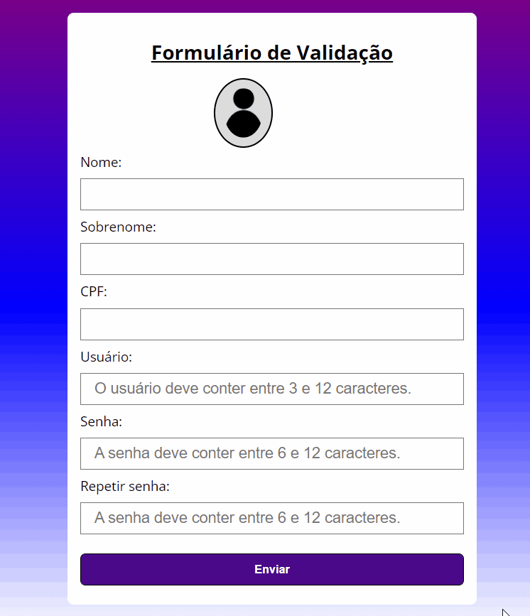
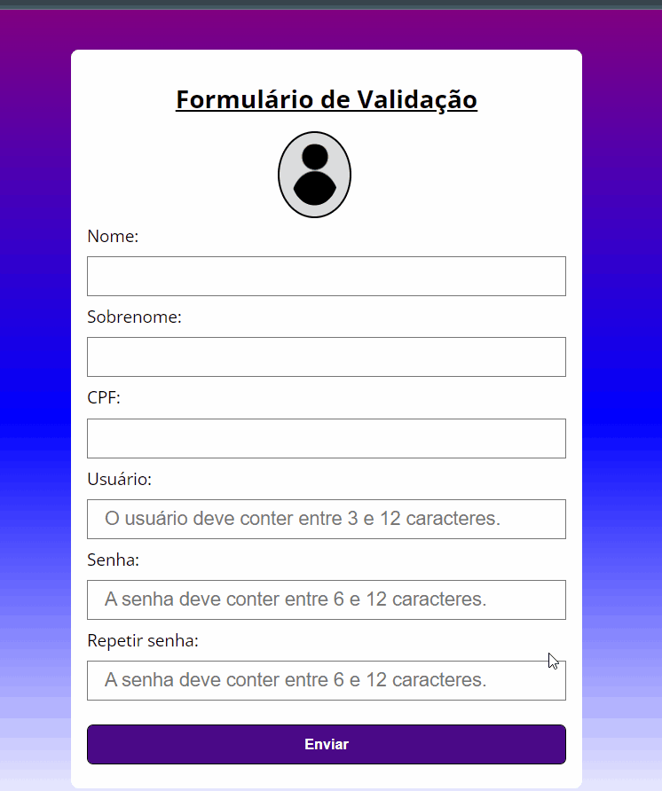

<h1 style="textDecoration = underline">Formulário de Validação em JavaScript</h1>

<h2>✍️Construção do Projeto</h2>

Este é um formulário de validação usando somente recursos do front-end. Projeto criado utilizando classes com o objetivo de entender melhor a funcionalidade destes recursos, além disso foram utilizadas expressões regulares, para filtrar alguns campos, cujo as regras de validação deve corresponder a:

 <ul>
      <li>Nenhum campo pode estar vazio</li>
      <li>Usuário só poderá conter letras e/ou números</li>
      <li>Usuário deverá ter entre 3 e 12 caracteres</li>
      <li>Senha precisa ter entre 6 e 12 caracteres</li>
    </ul>

<h3>⚙️Funcionamento Geral</h3>

 
🔗[Clique aqui para acessar](https://pedrodevvv.github.io/Formulario_validacao_JS/)  

<h2>Como funciona a validação do CPF ?</h2>

Para realizar está validação, foi desenvolvido um algorítmo que segue algumas regras dispostas pela receita federal para realizar essa validação. Basta somar os 9 primeiros dígitos do CPF, após isso essa soma será colocada em uma formula: 11 - (X % 11), e deve retornar um número, caso o número seja maior que 9 consideramos 0. Agora incluiremos esse digito junto aos 9 primeiros do CPF original, realizada a soma novamente e também a mesma conta com o resultado desta soma: 11 - (X % 11), mais uma vez devemos considerar 0 caso o resultado seja maior que 9, agora basta comparar esses 2 números gerados com os 2 ultimos números do CPF original e saberemos se é um CPF válido ou não. Este algoritmo foi desenvolvido em um arquivo separado, também utilizando classes para sua construção, sendo chamado por um método no código da validação do formulário

 
🔗[Clique aqui para acessar](https://pedrodevvv.github.io/Formulario_validacao_JS/)  

<h3>🛠️Tecnologias utilizadas</h3>

* JavaScript
* HTML
* CSS
* Visual Studio Code

<h3>📞 Contato</h3>

📩E-mail: pedrohgs2004@gmail.com  
🌐Linkedin: https://www.linkedin.com/in/pedro-henrique-g-silva-a2100a23a/?originalSubdomain=br
